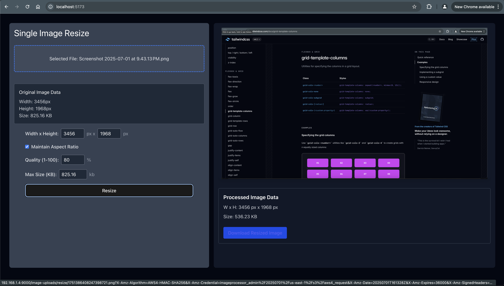

# Image Formatter App

  
  
  
  
  
  
  
  
  
  
  
  
  
  
  
          

---

A web application for resizing, compressing, and smart-cropping images using Go, Vite + Preact, Redis, S3/MinIO, and (planned) OpenCV.

---

## Quick Start

1. Copy `deploy/.env.example` to `deploy/.env` and fill out any secrets you need.
2. `cd deploy`
3. `docker-compose up --build`
4. Visit [http://localhost:8080](http://localhost:8080)

---

## Project Overview

- **Single & Batch Image Resize**
- **Compression & Quality Control**
- **Maintain Aspect Ratio**
- **Progress Feedback**
- **Download Results**
- **API Authentication**
- **Temporary S3 Storage**
- **Modern UI (Vite + Preact + Tailwind CSS)**
- **Dockerized for easy deployment**

---

## Documentation

- [Architecture & Features](./docs/ARCHITECTURE_AND_FEATURES.md)
- [API Reference](./docs/API.md)
- [Frontend Plan](./docs/FRONTEND_PLAN.md)
- [Project Structure](./docs/project-structure.md)
- [Conversation Summary](./docs/CONVERSATION_SUMMARY-1.md)

---
